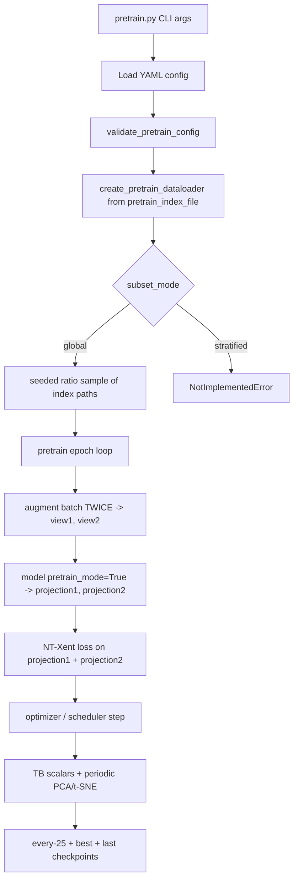

# Instructions
1. Only start implementing when all tests for each phase exist.
2. We will log both human readable log, and a JSON log optimized for LLM reading and parsing.
3. We will save a model every 25 epochs, plus best and last.
4. Elaborate the tests done and only move forward once we are convinced we have implemented the task correctly.


# Self-Supervised Pretraining Pipeline Plan

## Scope and Goal

Implement a **standalone pretraining script (`pretrain.py`)** that runs unsupervised contrastive learning on `pretrain_index_file`, saves outputs to a pretrain-tagged experiment directory, logs contrastive-relevant metrics/visualizations (no confusion matrices), and prepares checkpoints for later fine-tuning.

## Key Design Choices (Locked)

- **Separate entry point**: `pretrain.py` — does not touch `train.py` at all.
- **Pure self-supervised contrastive objective**: SimCLR/InfoNCE-style NT-Xent.
- **No normalization**: pretrain path skips `setup_normalization` entirely.
- **Batch size 256**: required for NT-Xent to have sufficient in-batch negatives.
- **Projection head required**: NT-Xent loss is computed on `projection` output, not `features`. See theory section below.
- **Subset mode switch** for pretraining index sampling:
  - `global` ratio sampling: implemented.
  - `stratified` ratio sampling: config supported but explicitly raises `NotImplementedError` for now.
- **No `apply_class_subset`**: pretrain path never calls this function.

## Files to Create / Modify

- **NEW** pretrain entry point: `/home/misra8/demo_codebase/src2/train_test/pretrain.py`
- **NEW** pretrain loop + SSL logging: add `pretrain()` function to `/home/misra8/demo_codebase/src2/train_test/train_test_utils.py`
- **NEW** pretrain dataloader: add `create_pretrain_dataloader()` to `/home/misra8/demo_codebase/src2/dataset_utils/MultiModalDataLoader.py`
- **MODIFY** contrastive losses: `/home/misra8/demo_codebase/src2/train_test/loss.py` — add `NTXentLoss`
- **MODIFY** model files — add `pretrain_mode` support:
  - `/home/misra8/demo_codebase/src2/models/ResNet.py`
  - `/home/misra8/demo_codebase/src2/models/DeepSenseLatest.py`
  - `/home/misra8/demo_codebase/src2/models/DeepSenseDepthwise.py`
  - `/home/misra8/demo_codebase/src2/models/create_models.py`
- **MODIFY** YAML config: `/home/misra8/demo_codebase/src2/data/Parkland.yaml` — add pretrain training config + experiment entries

## Proposed Training/Data Flow




## Implementation Tasks

### 1) Create `pretrain.py` — Standalone Entry Point

Create `/home/misra8/demo_codebase/src2/train_test/pretrain.py` mirroring the structure of `train.py` but with a clean pretrain-only flow:

```
CLI parse  →  load YAML  →  validate_pretrain_config()
           →  create_pretrain_dataloader()         (NO supervised loaders, NO normalization)
           →  create_augmenter()                   (reuse existing, tied to pretrain experiment config)
           →  setup_experiment_dir()               (name includes 'pretrain' token)
           →  setup_train_file_logging()
           →  create_single_modal_model(..., pretrain_mode=True)
           →  NTXentLoss(temperature=...)
           →  setup_optimizer() / setup_scheduler()
           →  pretrain()                           (new function in train_test_utils.py)
           →  save resolved config.yaml to experiment dir
```

**CLI args for `pretrain.py`:**
```
--experiment_name   (required) key into experiments: section of YAML
--yaml_path         (required) path to YAML config file
--gpu               (default 0; -1 for CPU)
```

**`validate_pretrain_config(config)`** (new helper, can live in `train_test_utils.py`):
- Checks `pretrain_index_file` exists on disk.
- Checks experiment name is in `config["experiments"]`.
- Checks the resolved training config has `type == "ssl_pretrain"`.
- Checks `pretrain_subset_ratio` is in (0, 1].
- Checks `pretrain_subset_mode` is `global` or `stratified`.
- Raises `NotImplementedError` immediately if mode is `stratified`.
- Raises `ValueError` with clear messages for all missing/invalid fields.

---

### 2) Pretrain Dataloader — `create_pretrain_dataloader()`

Add a new function to `MultiModalDataLoader.py`. Do **not** touch `create_dataloaders()`.

**Label note:** pretrain `.pt` files do have a label at `sample['label']` — it is a scalar tensor e.g. `tensor(5)`. Extract with `.item()` when needed. Labels are loaded but are **only used for visualization** (PCA/t-SNE coloring), never for the SSL loss computation.

```python
def create_pretrain_dataloader(config):
    """
    Builds a dataloader from pretrain_index_file with optional global ratio subset.
    No val/test splits. No balanced sampling. No normalization.
    Labels are returned for visualization only, not used in loss.
    """
    pretrain_index_file = config.get("pretrain_index_file")
    if not pretrain_index_file or not os.path.exists(pretrain_index_file):
        raise FileNotFoundError(f"pretrain_index_file not found: {pretrain_index_file}")

    subset_ratio = config.get("pretrain_subset_ratio", 1.0)
    subset_mode  = config.get("pretrain_subset_mode", "global")
    seed         = config.get("pretrain_seed", 42)
    batch_size   = config.get("batch_size", 256)   # should be 256 for NT-Xent
    num_workers  = config.get("num_workers", 4)

    # Load all paths from index file
    all_paths = list(np.loadtxt(pretrain_index_file, dtype=str))

    # Apply subset
    if subset_ratio < 1.0:
        if subset_mode == "global":
            rng = np.random.default_rng(seed)
            n = max(1, int(len(all_paths) * subset_ratio))
            idx = rng.choice(len(all_paths), size=n, replace=False)
            idx.sort()
            all_paths = [all_paths[i] for i in idx]
        elif subset_mode == "stratified":
            raise NotImplementedError(
                "Stratified pretrain subset is configured but not implemented yet."
            )
        else:
            raise ValueError(f"Unknown pretrain_subset_mode: {subset_mode}")

    dataset = PretrainDataset(all_paths)
    loader = DataLoader(
        dataset,
        batch_size=batch_size,
        shuffle=True,
        num_workers=num_workers,
        pin_memory=True,
        drop_last=True,   # NT-Xent needs consistent batch size; drop partial final batch
    )
    logging.info(f"Pretrain dataset: {len(dataset)} samples, {len(loader)} batches")
    return loader
```

**`PretrainDataset`** (new class, same file):
```python
class PretrainDataset(Dataset):
    """
    Dataset for SSL pretraining. Returns (data, label, idx).
    label is extracted from sample['label'] via .item() for use in visualization only.
    """
    def __init__(self, sample_paths):
        self.sample_files = sample_paths

    def __len__(self):
        return len(self.sample_files)

    def __getitem__(self, idx):
        sample = torch.load(self.sample_files[idx], weights_only=False)
        data   = sample["data"]
        label  = sample["label"]
        if isinstance(label, torch.Tensor):
            label = label.item()
        label = torch.tensor(label, dtype=torch.long)
        return data, label, idx
```

`drop_last=True` is critical: NT-Xent builds the negative matrix from 2*batch_size rows — a partial batch at the end of an epoch would produce a different-sized matrix and break the loss computation.

---

### 3) NT-Xent Loss — Add to `loss.py`

```python
class NTXentLoss(nn.Module):
    """
    NT-Xent (Normalized Temperature-scaled Cross Entropy) loss for SimCLR-style SSL.
    Operates on two projection views of shape [B, proj_dim].
    Positives: the two views from the same sample.
    Negatives: all other 2(B-1) views in the batch.

    Args:
        temperature: softmax temperature (default 0.5 for SSL; 0.07 is too sharp without large batches)
    """
    def __init__(self, temperature: float = 0.5):
        super().__init__()
        self.temperature = temperature

    def forward(self, proj1, proj2):
        # proj1, proj2: [B, D]
        B = proj1.shape[0]
        z = F.normalize(torch.cat([proj1, proj2], dim=0), dim=1)  # [2B, D]
        sim = torch.matmul(z, z.T) / self.temperature              # [2B, 2B]

        # Mask self-similarities
        mask = torch.eye(2 * B, dtype=torch.bool, device=z.device)
        sim.masked_fill_(mask, -1e9)

        # Positive indices: for i in [0,B) the positive is i+B; for i in [B,2B) it is i-B
        labels = torch.cat([torch.arange(B, 2*B), torch.arange(0, B)]).to(z.device)
        return F.cross_entropy(sim, labels)
```

Update `get_loss_function()` factory to handle `loss_name == "nt_xent"`:
```python
if loss_name == "nt_xent":
    temperature = float(training_config.get("nt_xent_temperature", 0.5))
    return NTXentLoss(temperature=temperature), loss_name
```

---

### 4) Model Pretrain Mode — Existing Models with Projection Head

**Short answer to "can we use existing models?":** Yes. The existing ResNet/DeepSense models already produce `features` (the output of the backbone before the classifier `fc`). For pretraining we:
1. Keep the **entire backbone unchanged** (no layers removed from weights).
2. Add a **projection MLP** head on top of `features`: `Linear(fc_dim, 256) → ReLU → Linear(256, 128)`.
3. When `pretrain_mode=True`, skip the classification `fc` layer entirely and instead return `{'features': ..., 'projection': ...}`.
4. When `pretrain_mode=False` (default), behaviour is **completely unchanged** — the projection head is never instantiated.

**In each model file**, add to `__init__`:
```python
self.pretrain_mode = model_config.get("pretrain_mode", False)
if self.pretrain_mode:
    proj_hidden = model_config.get("proj_hidden_dim", 256)
    proj_out    = model_config.get("proj_out_dim", 128)
    self.projection_head = nn.Sequential(
        nn.Linear(self.fc_dim, proj_hidden),
        nn.ReLU(inplace=True),
        nn.Linear(proj_hidden, proj_out),
    )
```

**In `forward()`**, change the return branch:
```python
if self.pretrain_mode:
    # features is the output of the backbone before the original classifier
    projection = self.projection_head(features)
    return {"features": features, "projection": projection}
else:
    # original supervised path — unchanged
    logits = self.fc(features)
    return {"logits": logits, "features": features, "exits": exits}
```

**In `create_models.py`**, `create_single_modal_model()` already passes the model config dict through — no change needed to the factory signature. The `pretrain_mode` key in the YAML model block is picked up automatically.

**Fine-tuning later:** Load pretrain checkpoint with `strict=False`. The projection head weights will be missing (expected) and the classifier head will be re-initialized.

**YAML model config additions** (in the model block used for pretraining):
```yaml
pretrain_mode: true
proj_hidden_dim: 256
proj_out_dim: 128
```

---

### 5) `pretrain()` Training Loop — Add to `train_test_utils.py`

Mirrors the structure of `train()` but with SSL-specific logic:

```python
def pretrain(
    model, train_loader, config, experiment_dir,
    loss_fn, augmenter, apply_augmentation_fn,
    optimizer, scheduler, num_epochs, model_name,
):
    """
    SSL pretraining loop. No validation loader. No classification metrics.
    Checkpoints: every 25 epochs, best (lowest loss), last epoch.
    PCA/t-SNE: logged every N epochs (configurable, default 10).
    """
    ...
    for epoch in range(num_epochs):
        model.train()
        for batch in train_loader:
            data, labels, _ = batch
            # Two independent augmented views
            view1 = apply_augmentation_fn(augmenter, data)
            view2 = apply_augmentation_fn(augmenter, data)  # called separately → different random ops
            out1  = model(view1)
            out2  = model(view2)
            proj1 = out1["projection"]
            proj2 = out2["projection"]
            loss  = loss_fn(proj1, proj2)
            ...
        # Checkpointing
        if (epoch + 1) % 25 == 0:
            save checkpoint: pretrain_epoch_{epoch+1}.pth
        if loss < best_loss:
            save checkpoint: best_pretrain_model.pth
    # End of training
    save checkpoint: last_pretrain_model.pth
```

**SSL metrics to log per epoch (TensorBoard + JSON log):**
- `pretrain/loss` — NT-Xent loss
- `pretrain/lr` — current learning rate
- `pretrain/feature_norm_mean` — mean L2 norm of `features` (collapse detector)
- `pretrain/proj_norm_mean` — mean L2 norm of `projection`
- `pretrain/pos_similarity` — mean cosine similarity between the two views of the same sample
- `pretrain/neg_similarity` — mean cosine similarity between different samples

**Collapse detection:** if `feature_norm_mean` drops below 1e-3 or all `pos_similarity` values converge to the same value, log a WARNING. Feature collapse means the model has degenerated to outputting near-zero embeddings.

**PCA/t-SNE visualization:**
- Run every `viz_every_n_epochs` epochs (default: 10, configurable).
- **Subsample to a maximum of 2000 embeddings** before running t-SNE (t-SNE is O(n²) — running on full pretrain data is prohibitively slow).
- Color points by label (labels are loaded from the dataset for visualization only, not used in loss).
- Save as PNG to `experiment_dir/viz/` and also log to TensorBoard.

---

### 6) Pretrain Experiment Directory + Artifacts

- **Directory naming:** `<timestamp>_pretrain_<experiment_name>` — enforced in `setup_experiment_dir()` by passing a `pretrain_prefix=True` flag or by prepending in `pretrain.py` before calling the helper.
- **Checkpoints saved to** `experiment_dir/models/`:
  - `pretrain_epoch_25.pth`, `pretrain_epoch_50.pth`, ... (every 25 epochs)
  - `best_pretrain_model.pth` (lowest NT-Xent loss seen)
  - `last_pretrain_model.pth` (final epoch)
- **Logs saved to** `experiment_dir/logs/pretrain.log` (human readable) + `pretrain_log.json` (LLM-parseable).
- **Config saved to** `experiment_dir/config.yaml` at the end of training.
- **Viz saved to** `experiment_dir/viz/pca_epoch_N.png`, `tsne_epoch_N.png`.

---

### 7) YAML Config Additions — `Parkland.yaml`

Add to `training_configs:` section:
```yaml
training_configs:
  ssl_pretrain_ce:
    type: "ssl_pretrain"
    epochs: 200
    loss_name: "nt_xent"
    nt_xent_temperature: 0.5
    pretrain_subset_ratio: 1.0
    pretrain_subset_mode: "global"
    pretrain_seed: 42
    viz_every_n_epochs: 10
    optimizer:
      name: "AdamW"
      start_lr: 0.0003
      warmup_lr: 0.000001
      min_lr: 0.000001
      clip_grad: 5.0
      weight_decay: 0.05
    lr_scheduler:
      name: "cosine"
      warmup_prefix: True
      warmup_epochs: 10
      decay_epochs: 2
      decay_rate: 0.2
```

Add to `experiments:` section:
```yaml
experiments:
  pretrain_audio_resnet:
    model: "student_audio_resnet"      # existing model entry, add pretrain_mode: true to it
    training: "ssl_pretrain_ce"
    fixed_augmenters:
      time_augmenters: ["time_mask"]
      freq_augmenters: ["freq_mask"]

  pretrain_audio_deepsense_dw:
    model: "student_audio_deepsense_dw"
    training: "ssl_pretrain_ce"
    fixed_augmenters:
      time_augmenters: ["time_mask"]
      freq_augmenters: ["freq_mask"]
```

Add `pretrain_mode: true`, `proj_hidden_dim: 256`, `proj_out_dim: 128` to whichever model blocks are used in pretrain experiments.

Also set `batch_size: 256` in root config (or override per training config if possible).

---

### 8) Theory: Two-View Augmentation in SSL vs Supervised Contrastive

> **This section explains the theory. Delete before final plan review.**

#### What you already have: Supervised Contrastive (`ce_supcon`)

You already have a two-view training loop in `train_vanilla_supervised_contrastive`. It works like this:

```
batch: N samples with labels [y_1, y_2, ..., y_N]

view1 = augment(batch)   # first random augmentation pass
view2 = augment(batch)   # second random augmentation pass

out1 = model(view1)   # {'logits': [N,C], 'features': [N,D]}
out2 = model(view2)   # {'logits': [N,C], 'features': [N,D]}

loss = 0.5 * (CE(out1.logits, labels) + CE(out2.logits, labels))   # classification term
     + SupCon(out1.features, out2.features, labels)                  # contrastive term
```

In SupCon: **positives** = any two samples with the **same class label** (including the two views of sample i, but also view1 of sample i and view1/view2 of sample j if same class). It requires labels.

#### What SSL (NT-Xent / SimCLR) does differently

```
batch: N samples — labels are IGNORED in the loss

view1 = augment(batch)   # first random augmentation pass
view2 = augment(batch)   # second independent augmentation pass — same code, different random ops

out1 = model(view1)   # {'features': [N,D], 'projection': [N,P]}
out2 = model(view2)   # {'features': [N,D], 'projection': [N,P]}

# Concatenate into 2N views
z = concat([out1.projection, out2.projection])  # [2N, P]

# For sample i (row i in z), its ONLY positive is row i+N (the other view of the same sample)
# All other 2(N-1) rows are treated as negatives

loss = NT-Xent(z)   # no labels needed
```

**Key differences from supervised contrastive:**

| | Supervised Contrastive (`ce_supcon`) | SSL NT-Xent |
|---|---|---|
| Requires labels | Yes (for positive pairs + CE) | No (self-supervised) |
| What counts as a "positive" | All samples of the same class | Only the other augmented view of the same sample |
| Loss terms | CE + SupCon | NT-Xent only |
| Output used | `logits` + `features` | `projection` only |
| Projection head | Not used | Required (critical for quality) |

**Why the projection head matters (critical):**
SimCLR (Chen et al., 2020) showed that applying NT-Xent directly on `features` hurts downstream task performance. The projection head acts as a "buffer" — it absorbs the invariances enforced by the contrastive objective, while `features` retains richer information useful for fine-tuning. For fine-tuning, you **discard the projection head** and attach a new classifier on top of `features`.

**The two-view call pattern — why you call augment twice:**
```python
# CORRECT: two independent calls → different random ops each time
view1 = apply_augmentation(augmenter, data)   # e.g. time_mask drops bins 10-20
view2 = apply_augmentation(augmenter, data)   # e.g. time_mask drops bins 45-60 (different roll)

# WRONG: calling once and splitting
views = apply_augmentation(augmenter, data)   # same mask applied → views are too similar
view1, view2 = views, views                   # identical → contrastive loss is trivially 0
```

The augmenter must have internal randomness (which existing augmenters do — they sample new random parameters on each call). Calling `apply_augmentation_fn` twice on the same `data` tensor with the same augmenter instance produces two different augmented outputs because the random state advances between calls.

---

### 9) Validation, Smoke Tests, and Safeguards

- `validate_pretrain_config()` runs before anything else and catches all config errors with clear messages.
- Smoke test: run with `pretrain_subset_ratio: 0.01` to validate end-to-end in < 1 minute.
- What smoke test must verify:
  - Dataloader builds from `pretrain_index_file` without label errors
  - Two-view augmentation produces visibly different tensors (assert `(view1 != view2).any()`)
  - Model forward in `pretrain_mode=True` returns `projection` key
  - NT-Xent loss is scalar, finite, and positive
  - PCA/t-SNE figures are generated at `viz_epoch_1.png`
  - Checkpoint files written at epoch 25 boundary (or end of smoke run) and at `last_pretrain_model.pth`
  - `experiment_dir` name contains `pretrain`

---

## Suggested Losses / Metrics (current + future)

- **Now:** NT-Xent (InfoNCE) with two augmented views.
- **Later options:**
  - BYOL/SimSiam (no negatives, good when batch negatives are weak or batch size must stay small)
  - Barlow Twins / VICReg (redundancy reduction; more stable at large scale)
- **Useful pretrain diagnostics:** alignment/uniformity scores, KNN-on-embedding probe (optional, run on val set after pretraining).

## Risks and Mitigations

- **Feature collapse**: monitor `feature_norm_mean` and `pos_similarity` variance; add WARNING if collapse detected.
- **Augmentation too weak / too strong**: log positive similarity stats; if pos_sim ≈ 1.0 augmentation is too weak (views too similar), if pos_sim ≈ neg_sim augmentation is too strong (views too dissimilar for the model to connect).
- **Checkpoint transfer mismatch**: fine-tuning uses `strict=False` load; projection head weights are discarded, classifier is re-initialized.
- **t-SNE slowness**: hard cap at 2000 samples per visualization call.

## Completion Criteria

- `python pretrain.py --experiment_name pretrain_audio_resnet --yaml_path ../data/Parkland.yaml --gpu 0` launches SSL pipeline end-to-end.
- Experiment directory name contains `pretrain` and stores pretrain checkpoints/logs/viz.
- Pretrain dataloader uses `pretrain_index_file` + ratio subset (`global` implemented, `stratified` explicit TODO error).
- ResNet/DeepSenseLatest/DeepSenseDepthwise support `pretrain_mode=True` output contract (`features` + `projection`).
- NT-Xent loss computed on `projection` outputs; `features` untouched by loss.
- Checkpoints saved every 25 epochs + best + last.
- PCA and t-SNE visualizations generated and logged to TensorBoard.
