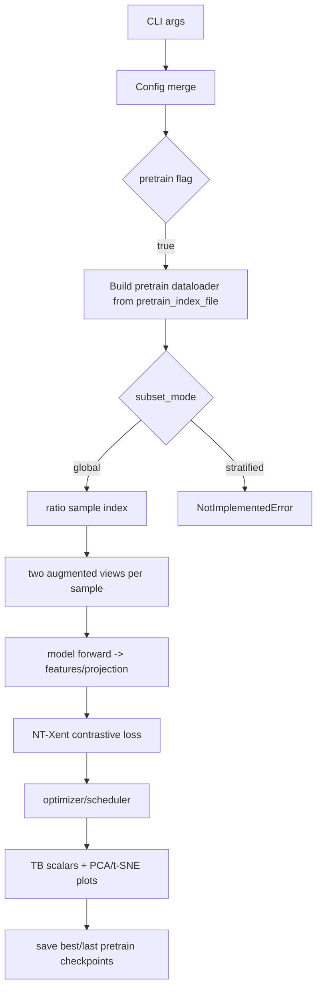

# Instructions 
1. Only start implementing when all tests for each phase exists.
2. 

# Self-Supervised Pretraining Pipeline Plan

## Scope and Goal

Implement a **pretraining-only training path** (single modality) that runs unsupervised contrastive learning on `pretrain_index_file`, saves outputs to a pretrain-tagged experiment directory, logs contrastive-relevant metrics/visualizations (without confusion matrices), and prepares checkpoints for later fine-tuning.

## Key Design Choices (Locked)

- Use **pure self-supervised contrastive objective** (SimCLR/InfoNCE-style NT-Xent) for this phase.
- Add a **subset mode switch** for pretraining index sampling:
  - `global` ratio sampling: implemented.
  - `stratified` ratio sampling: config supported but explicitly raises `NotImplementedError` for now.
- Keep the requested CLI flag route: `--pretrain` in arg parsing and pipeline routing.

## Files to Modify

- CLI/config wiring: `[/home/misra8/demo_codebase/src2/dataset_utils/parse_args_utils.py](/home/misra8/demo_codebase/src2/dataset_utils/parse_args_utils.py)`
- Train orchestration + experiment naming: `[/home/misra8/demo_codebase/src2/train_test/train.py](/home/misra8/demo_codebase/src2/train_test/train.py)`
- Core pretrain loop + embeddings visualization/logging: `[/home/misra8/demo_codebase/src2/train_test/train_test_utils.py](/home/misra8/demo_codebase/src2/train_test/train_test_utils.py)`
- Contrastive losses and loss factory hooks: `[/home/misra8/demo_codebase/src2/train_test/loss.py](/home/misra8/demo_codebase/src2/train_test/loss.py)`
- Pretrain index ingestion/subset logic: `[/home/misra8/demo_codebase/src2/dataset_utils/MultiModalDataLoader.py](/home/misra8/demo_codebase/src2/dataset_utils/MultiModalDataLoader.py)`
- Model pretrain outputs/head options:
  - `[/home/misra8/demo_codebase/src2/models/ResNet.py](/home/misra8/demo_codebase/src2/models/ResNet.py)`
  - `[/home/misra8/demo_codebase/src2/models/DeepSenseLatest.py](/home/misra8/demo_codebase/src2/models/DeepSenseLatest.py)`
  - `[/home/misra8/demo_codebase/src2/models/DeepSenseDepthwise.py](/home/misra8/demo_codebase/src2/models/DeepSenseDepthwise.py)`
  - `[/home/misra8/demo_codebase/src2/models/create_models.py](/home/misra8/demo_codebase/src2/models/create_models.py)`
- Config example updates for Parkland pretrain settings: `[/home/misra8/demo_codebase/src2/data/Parkland.yaml](/home/misra8/demo_codebase/src2/data/Parkland.yaml)`

## Proposed Training/Data Flow

## Implementation Tasks

### 1) Add pretrain mode + config plumbing

- Add `--pretrain` boolean to CLI parsing and persist into merged config.
- Add pretrain-specific config keys (with defaults), e.g.:
  - `pretrain_index_file` (already present in YAML root)
  - `pretrain_subset_ratio`
  - `pretrain_subset_mode` (`global` / `stratified`)
  - `pretrain_seed`
  - `pretrain_loss_name` (`nt_xent`)
- In `train.py`, branch early to pretrain route when `config['pretrain']` is true.
- Define precedence clearly: CLI `--pretrain` overrides training config type only for this first iteration.

### 2) Wire pretrain dataloader from `pretrain_index_file`

- Extend dataloader creation path to support a pretrain loader based on YAML root `pretrain_index_file`.
- Implement `global` ratio subsampling deterministically (seeded) by creating an in-memory subset of index paths before dataset creation.
- Add `stratified` switch path that raises `NotImplementedError("Stratified pretrain subset is configured but not implemented yet")`.
- Ensure no leakage with supervised val/test loaders (pretrain path independent for now).

### 3) Implement pretraining loss + augment-view contract

- Add NT-Xent/InfoNCE loss in `loss.py` with temperature hyperparameter.
- Add a helper to generate two augment views per batch item (reusing `Augmenter` mechanics where possible).
- Define model output contract for pretraining:
  - Required: `features`
  - Optional: `projection` (if projection head enabled)
  - `logits` may exist but is ignored in pure pretrain objective.

### 4) Add model pretrain variants (single modality)

- Add optional projection-head settings for pretrain variants in the three target model files.
- Keep supervised behavior unchanged when pretrain options are off.
- Update model factory to instantiate pretrain-enabled variants from config without breaking existing model definitions.
- Keep checkpoint compatibility in mind for later fine-tuning (`strict=False` loading for mismatched classifier/projection head shapes).

### 5) Add `pretrain()` training function + logging

- Create separate `pretrain()` in `train_test_utils.py` mirroring robust pieces of existing train loop:
  - epoch loop, optimizer/scheduler stepping, checkpointing, file logger, tensorboard.
- Replace classification metrics with pretrain-relevant logging:
  - training loss, learning rate, embedding norm, positive/negative similarity stats.
- Add embedding visualization hooks:
  - PCA plot
  - t-SNE plot
- Skip confusion matrix and classification reports in pretrain mode.

### 6) Pretrain experiment directory naming + artifacts

- Ensure experiment dir naming includes `pretrain` token (e.g., `<timestamp>_pretrain_<experiment_name>`).
- Save pretrain outputs distinctly (`best_pretrain_model.pth`, `last_pretrain_epoch.pth`) or clearly separated model paths.
- Persist resolved config to experiment folder with pretrain knobs for reproducibility.

### 7) Validation, smoke tests, and safeguards

- Add a small smoke workflow using low subset ratio to validate:
  - dataloader builds from `pretrain_index_file`
  - pretrain loop runs end-to-end
  - PCA/t-SNE figures are generated
  - checkpoints + logs written under pretrain experiment folder
- Add explicit runtime errors for missing `pretrain_index_file`, invalid ratio/mode, and absent projection/features.

## Suggested Losses / Metrics (for current + future)

- **Now (recommended):** NT-Xent (InfoNCE) with two augmented views.
- **Later options:**
  - BYOL/SimSiam (no negatives, good when batch negatives are weak)
  - Barlow Twins / VICReg (redundancy reduction; stable large-scale SSL)
- **Useful pretrain diagnostics:** alignment/uniformity, temperature-scaled similarity histograms, KNN-on-embedding quick probe (optional).

## Risks and Mitigations

- Large pretrain dataset I/O pressure: start with low ratio + deterministic seed for quick iteration.
- Augmentation mismatch can collapse contrastive objective: log feature variance and cosine distribution to detect collapse early.
- Checkpoint transfer mismatch in fine-tuning: document expected non-strict loading path for classifier/projection layers.

## Completion Criteria

- `--pretrain` launches SSL pipeline end-to-end without classification metrics.
- Experiment directory name contains `pretrain` and stores pretrain checkpoints/logs.
- Pretrain dataloader uses `pretrain_index_file` + ratio subset (`global` implemented, `stratified` explicit TODO error).
- ResNet/DeepSenseLatest/DeepSenseDepthwise support pretrain-output contract for SSL training.
- PCA and t-SNE visualizations are logged during pretraining.

